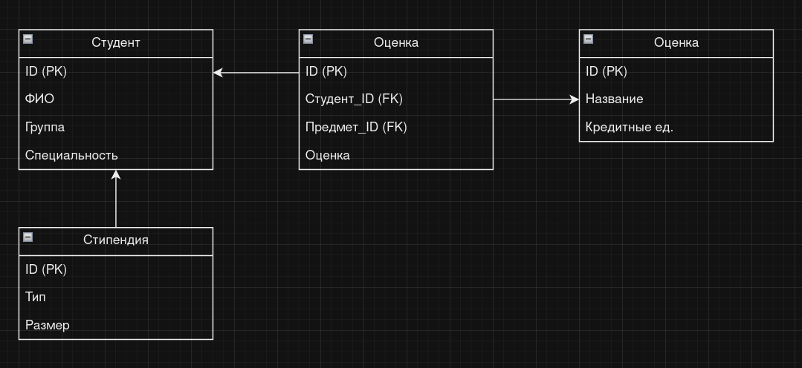

# Задание на курсовую работу по МДК 11.01 "Технология разработки и защиты баз данных"

## Специальность: 09.02.07 "Информационные системы и программирование"

### Тема курсовой работы: 
Разработка базы данных для автоматизации процесса начисления стипендий в средних специальных учебных заведениях (ССУЗ)

### Срок представления работы к защите: 
15 ноября 2024 года.

## Перечень подлежащих разработке вопросов:

1. Анализ предметной области. Постановка задачи.
   - Описание предметной области и функции решаемых задач.
   - Перечень входных данных.
   - Перечень выходных данных.
   - Ограничения предметной области (если таковые имеются).
   - Взаимодействие с другими программами.

2. Инфологическая (концептуальная) модель базы данных.
   - Выделение информационных объектов.
   - Определение атрибутов объектов.
   - Определение отношений и мощности отношений между объектами.
   - Построение концептуальной модели.

3. Логическая структура БД.

4. Физическая структура базы данных.

5. Реализация проекта в среде конкретной СУБД.
   - Создание таблиц.
   - Создание запросов.
   - Разработка интерфейса.
   - Назначение прав доступа.
   - Создание индексов.
   - Разработка стратегии резервного копирования базы данных.

Руководитель работы __________________ <ins> И. В. Пунгин </ins>

Задание принял к исполнению _______________________________ <ins> Д. Е. Чернов </ins>


# Введение

В данной курсовой работе рассматривается процесс разработки базы данных для автоматизации начисления стипендий в средних специальных учебных заведениях (ССУЗ). Актуальность темы обусловлена необходимостью упрощения и автоматизации процессов учета студентов и их успеваемости, а также расчета и начисления стипендий.


# Анализ предметной области

## 1. Описание предметной области и функции решаемых задач
Предметная область включает в себя процесс начисления стипендий студентам ССУЗов. Основные функции системы:
- Учет студентов и их успеваемости.
- Расчет и начисление стипендий на основе успеваемости.
- Генерация отчетов о начисленных стипендиях и статистики.

## 2. Перечень входных данных
- Данные о студентах (ФИО, группа, специальность).
- Данные о предметах и оценках.
- Информация о типах стипендий и их размерах.

## 3. Перечень выходных данных
- Список студентов с начисленными стипендиями.
- Отчеты по выплатам стипендий.
- Статистика успеваемости студентов.

## 4. Ограничения предметной области
- Правила начисления стипендий (например, минимальные оценки для получения стипендии).
- Сроки подачи заявлений на стипендию.

## 5. Взаимодействие с другими программами
Система может взаимодействовать с другими образовательными системами для получения данных об успеваемости студентов и их личных данных.


# Инфологическая (концептуальная) модель базы данных

## 1. Выделение информационных объектов
- Студент
- Предмет
- Оценка
- Стипендия

## 2. Определение атрибутов объектов
- **Студент**: ID, ФИО, группа, специальность
- **Предмет**: ID, название, кредитные единицы
- **Оценка**: ID, студент_ID, предмет_ID, оценка
- **Стипендия**: ID, тип, размер

## 3. Определение отношений и мощности отношений между объектами
- Студент (1) - Оценка (N)
- Предмет (1) - Оценка (N)
- Студент (1) - Стипендия (N)

## 4. Построение концептуальной модели
### ER-диаграмма для базы данных "Стипендии"

В данной секции представлена ER-диаграмма, описывающая основные сущности и их связи в базе данных для автоматизации процесса начисления стипендий в средних специальных учебных заведениях (ССУЗ).

### Сущности и их атрибуты

1. **Студент**
   - ID (первичный ключ)
   - ФИО
   - Группа
   - Специальность

2. **Предмет**
   - ID (первичный ключ)
   - Название
   - Кредитные единицы

3. **Оценка**
   - ID (первичный ключ)
   - Студент_ID (внешний ключ)
   - Предмет_ID (внешний ключ)
   - Оценка

4. **Стипендия**
   - ID (первичный ключ)
   - Тип
   - Размер

### Связи между сущностями

- **Студент** (1) — **Оценка** (N): Один студент может иметь много оценок.
- **Предмет** (1) — **Оценка** (N): Один предмет может иметь много оценок от разных студентов.
- **Студент** (1) — **Стипендия** (N): Один студент может получать несколько типов стипендий.

## Визуальная ER-диаграмма



## Описание диаграммы

- **Студент** связан с **Оценка** через внешний ключ `Студент_ID`, что позволяет отслеживать оценки, полученные каждым студентом.
- **Предмет** также связан с **Оценка** через внешний ключ `Предмет_ID`, что позволяет отслеживать, какие оценки были получены по каждому предмету.
- **Стипендия** связана с **Студент** через внешний ключ, что позволяет отслеживать, какие стипендии получает каждый студент.


# Логическая структура БД

На этом этапе концептуальная модель преобразуется в логическую структуру, где каждая сущность будет представлена таблицей. Определяются типы данных для каждого атрибута и устанавливаются связи между таблицами.


# Физическая структура базы данных

Физическая структура будет зависеть от выбранной СУБД. Здесь будет описан процесс создания таблиц, индексов и других объектов базы данных, а также их размещение на диске.


# Реализация проекта в среде конкретной СУБД

### 1. Создание таблиц
Здесь описываем SQL-запросы для создания таблиц, соответствующих логической структуре базы данных.

```sql
CREATE TABLE Students (
    ID INT PRIMARY KEY,
    FullName VARCHAR(100),
    GroupName VARCHAR(50),
    Specialty VARCHAR(100)
);

CREATE TABLE Subjects (
    ID INT PRIMARY KEY,
    Name VARCHAR(100),
    Credits INT
);

CREATE TABLE Grades (
    ID INT PRIMARY KEY,
    StudentID INT,
    SubjectID INT,
    Grade DECIMAL(3, 2),
    FOREIGN KEY (StudentID) REFERENCES Students(ID),
    FOREIGN KEY (SubjectID) REFERENCES Subjects(ID)
);

CREATE TABLE Scholarships (
    ID INT PRIMARY KEY,
    Type VARCHAR(50),
    Amount DECIMAL(10, 2)
);
```

### 2. Создание запросов
Здесь описываем примеры SQL-запросов для получения данных о студентах и их стипендиях.

```sql
SELECT s.FullName, SUM(g.Grade) AS Total Grades
FROM Students s
JOIN Grades g ON s.ID = g.StudentID
GROUP BY s.FullName;
```

### 3. Разработка интерфейса
В данном разделе описан процесс создания пользовательского интерфейса (UI) для взаимодействия с базой данных, связанной с процессом начисления стипендий в средних специальных учебных заведениях (ССУЗ). Интерфейс включает формы для ввода данных, отображения отчетов и управления записями.


## 1. Определение требований к интерфейсу


Перед началом разработки интерфейса необходимо определить основные требования:


- **Удобство использования**: Интерфейс должен быть интуитивно понятным и простым в использовании для пользователей с разным уровнем технической подготовки.

- **Функциональность**: Интерфейс должен обеспечивать все необходимые функции для работы с базой данных, включая добавление, редактирование, удаление и просмотр записей.

- **Отчеты**: Возможность генерации отчетов по стипендиям, оценкам и студентам.

- **Безопасность**: Защита данных и контроль доступа к различным функциям интерфейса.


## 2. Выбор технологии для разработки интерфейса


Для разработки пользовательского интерфейса можно использовать различные технологии, такие как:


- **Web-приложения**: HTML, CSS, JavaScript с использованием фреймворков, таких как React, Angular или Vue.js.

- **Десктопные приложения**: Java (Swing, JavaFX), C# (WPF, WinForms), Python (Tkinter, PyQt).

- **Мобильные приложения**: React Native, Flutter, или нативные разработки для Android и iOS.


В данном примере мы будем рассматривать создание веб-приложения с использованием HTML, CSS и JavaScript.


## 3. Структура интерфейса


Интерфейс будет состоять из следующих основных компонентов:


- **Главная страница**: Общее представление о системе, ссылки на другие разделы.

- **Форма для ввода данных о студентах**: Поля для ввода ФИО, группы и специальности.

- **Форма для ввода данных о предметах**: Поля для ввода названия предмета и кредитных единиц.

- **Форма для ввода оценок**: Поля для выбора студента, предмета и ввода оценки.

- **Форма для управления стипендиями**: Поля для ввода типа и размера стипендии.

- **Отчеты**: Страница для отображения отчетов по студентам, оценкам и стипендиям.


## 3.1. Пример реализации интерфейса


### 3.1.1. Главная страница (index.html)


```html

<!DOCTYPE html>

<html lang="ru">

<head>

    <meta charset="UTF-8">

    <meta name="viewport" content="width=device-width, initial-scale=1.0">

    <title>Система начисления стипендий</title>

    <link rel="stylesheet" href="styles.css">

</head>

<body>

    <header>

        <h1>Система начисления стипендий</h1>

        <nav>

            <ul>

                <li><a href="students.html">Студенты</a></li <li><a href="subjects.html">Предметы</a></li>

                <li><a href="grades.html">Оценки</a></li>

                <li><a href="scholarships.html">Стипендии</a></li>

                <li><a href="reports.html">Отчеты</a></li>

            </ul>

        </nav>

    </header>

    <main>

        <h2>Добро пожаловать в систему!</h2>

        <p>Выберите раздел для работы с данными.</p>

    </main>

    <footer>

        <p>&copy; 2023 Система начисления стипендий</p>

    </footer>

</body>

</html>
```
### 3.1.2. Форма для ввода данных о студентах (students.html)
```html
html

<!DOCTYPE html>

<html lang="ru">

<head>

    <meta charset="UTF-8">

    <meta name="viewport" content="width=device-width, initial-scale=1.0">

    <title>Студенты</title>

    <link rel="stylesheet" href="styles.css">

</head>

<body>

    <header>

        <h1>Добавление студента</h1>

    </header>

    <main>

        <form id="studentForm">

            <label for="name">ФИО:</label>

            <input type="text" id="name" required>

            

            <label for="group">Группа:</label>

            <input type="text" id="group" required>

            

            <label for="specialty">Специальность:</label>

            <input type="text" id="specialty" required>

            

            <button type="submit">Добавить студента</button>

        </form>

    </main>

    <footer>

        <p>&copy; 2023 Система начисления стипендий</p>

    </footer>

</body>

</html>
```
### 3.1.3. Форма для ввода данных о предметах (subjects.html)

```html
<!DOCTYPE html>
<html lang="ru">
<head>
    <meta charset="UTF-8">
    <meta name="viewport" content="width=device-width, initial-scale=1.0">
    <title>Предметы</title>
    <link rel="stylesheet" href="styles.css">
</head>
<body>
    <header>
        <h1>Добавление предмета</h1>
    </header>
    <main>
        <form id="subjectForm">
            <label for="subjectName">Название предмета:</label>
            <input type="text" id="subjectName" required>
            
            <label for="credits">Кредитные единицы:</label>
            <input type="number" id="credits" required>
            
            <button type="submit">Добавить предмет</button>
        </form>
    </main>
    <footer>
        <p>&copy; 2023 Система начисления стипендий</p>
    </footer>
</body>
</html>
```

## 4. Назначение прав доступа
В данном разделе описывается, как будут управляться права доступа пользователей к различным функциям системы, включая создание ролей и назначение прав.


### 4.1. Определение ролей пользователей


Для управления доступом в системе будут определены следующие роли пользователей:


- **Администратор**: 

  - Полные права на управление системой.

  - Может добавлять, редактировать и удалять пользователей, а также управлять всеми данными в системе.

  

- **Преподаватель**: 

  - Может добавлять и редактировать данные о предметах и оценках.

  - Имеет доступ к просмотру отчетов по студентам и их оценкам.

  

- **Студент**: 

  - Может просматривать свои оценки и информацию о стипендиях.

  - Не имеет прав на редактирование данных в системе.


### 4.2. Назначение прав доступа


Каждая роль будет иметь определенные права доступа к функциям системы. Ниже приведена таблица с правами доступа для каждой роли:


| Функция | Администратор | Преподаватель | Студент |
|     :---:      |     :---:      |     :---:      |     :---:      |
| Управление пользователями    | Да     | Нет   |          Нет|
| Добавление студентов      | Да     | Да     |          Нет |
| Редактирование студентов       | Да       | Да     |          Нет |
| Удаление студентов      | Да       | Нет    |          Нет |
| Добавление предметов      | Да      | Да      |          Нет |
| Редактирование предметов | Да      | Да    |          Нет |
| Удаление предметов    | Да      | Нет     |          Нет |
| Добавление оценок  | Да      | Да    |          Нет |
| Просмотр оценок    | Да       | Да     |          Да |
| Генерация отчетов   | Да      | Да     |          Нет |
| Управление стипендиями    | Да      | Нет      |         Да |


### 4.3. Реализация управления правами доступа


Для реализации управления правами доступа в системе можно использовать следующие подходы:


- **Аутентификация**: Пользователи должны пройти процесс аутентификации (например, с помощью логина и пароля) для доступа к системе.

- **Авторизация**: После аутентификации система проверяет, какие права доступа имеет пользователь, и предоставляет доступ к соответствующим функциям.

- **Хранение ролей и прав**: Роли и права могут храниться в базе данных, что позволит легко управлять ими и изменять при необходимости.


### 4.4. Примеры реализации


### Пример структуры таблицы пользователей


```sql

CREATE TABLE users (

    id INT PRIMARY KEY AUTO_INCREMENT,

    username VARCHAR(50) NOT NULL,

    password VARCHAR(255) NOT NULL,

    role ENUM('admin', 'teacher', 'student') NOT NULL

);
```
### 4.5. Пример проверки прав доступа
```javascript
function checkAccess(userRole, action) {
    const permissions = {
        admin: ['manage_users', 'add_students', 'edit_students', 'delete_students', 'add_subjects', 'edit_subjects', 'delete_subjects', 'add_grades', ' 'view_grades', 'generate_reports', 'manage_scholarships'],
        teacher: ['add_students', 'edit_students', 'add_subjects', 'edit_subjects', 'add_grades', 'view_grades', 'generate_reports'],
        student: ['view_grades', 'manage_scholarships']
    };

    return permissions[userRole].includes(action);
}
```

## 5. Создание индексов
В данном разделе описывается, какие индексы будут созданы для оптимизации запросов к базе данных. Индексы позволяют ускорить выполнение операций поиска и сортировки, что особенно важно для больших объемов данных.


### 5.1. Зачем нужны индексы?


Индексы используются для:


- Ускорения выполнения запросов SELECT.

- Оптимизации операций JOIN между таблицами.

- Ускорения выполнения операций WHERE и ORDER BY.

- Обеспечения уникальности значений в столбцах.


### 5.2. Индексы, которые будут созданы


### 5.2.1. Индекс на таблице `students`


Для таблицы `students` будет создан индекс на поле `student_id`, чтобы ускорить поиск студентов по их идентификатору.


```sql

CREATE INDEX idx_student_id ON students (student_id);
```

### 5.2.2. Индекс на таблице subjects

Для таблицы subjects будет создан индекс на поле subject_name, чтобы ускорить поиск предметов по их названию.
```sql
CREATE INDEX idx_subject_name ON subjects (subject_name);
```
### 5.2.3. Индекс на таблице grades

Для таблицы grades будет создан составной индекс на полях student_id и subject_id, чтобы оптимизировать запросы, которые связывают студентов и предметы.
```sql
CREATE INDEX idx_student_subject ON grades (student_id, subject_id);
```
### 5.2.4. Индекс на таблице scholarships

Для таблицы scholarships будет создан индекс на поле scholarship_type, чтобы ускорить поиск стипендий по их типу.
```sql
CREATE INDEX idx_scholarship_type ON scholarships (scholarship_type);
```
### 5.3. Удаление индексов

Если в будущем возникнет необходимость удалить индекс, это можно сделать с помощью следующей команды:
```sql
DROP INDEX idx_student_id ON students;
```

## 6. Стратегия резервного копирования
В данном разделе описывается процесс резервного копирования базы данных, включая частоту резервного копирования и методы восстановления данных. Резервное копирование является важной частью управления данными, позволяя защитить информацию от потери в случае сбоя системы, повреждения данных или других непредвиденных обстоятельств.


### 6.1. Частота резервного копирования


Резервное копирование базы данных будет осуществляться с различной частотой в зависимости от важности данных и объема изменений:


- **Полное резервное копирование**: 

  - Будет выполняться раз в неделю. Это позволит создать полную копию всей базы данных, включая все таблицы и данные.

  

- **Инкрементное резервное копирование**: 

  - Будет выполняться ежедневно. Это позволит сохранить только изменения, произошедшие с момента последнего полного резервного копирования, что значительно сократит время и объем данных для резервирования.


### 6.2. Методы резервного копирования


Для резервного копирования базы данных будут использоваться следующие методы:


- **Логическое резервное копирование**: 

  - Данные будут экспортироваться в формате SQL с помощью команды `mysqldump` (для MySQL) или аналогичных инструментов для других СУБД. Это позволит создать текстовые файлы, которые можно будет легко восстановить.


    ```bash

    mysqldump -u username -p database_name > backup.sql

    ```


- **Физическое резервное копирование**: 

  - Будет осуществляться копирование файлов базы данных на уровне файловой системы. Этот метод может быть использован для быстрого восстановления в случае сбоя.


### 6.3. Процесс восстановления данных


Восстановление данных будет осуществляться в зависимости от типа резервного копирования:


- **Восстановление из полного резервного копирования**:

  - Для восстановления базы данных из полного резервного копирования будет использоваться команда `mysql` для импорта данных из файла SQL.


    ```bash

    mysql -u username -p database_name < backup.sql

    ```


- **Восстановление из инкрементного резервного копирования**:

  - В случае необходимости восстановления данных из инкрементного резервного копирования, сначала будет восстановлено полное резервное копирование, а затем применены все инкрементные резервные копии в порядке их создания.


### 6.4. Хранение резервных копий


Резервные копии будут храниться на отдельном сервере или в облачном хранилище для обеспечения безопасности данных. Рекомендуется хранить резервные копии в нескольких местах, чтобы минимизировать риск потери данных.


## 7. Заключение


Стратегия резервного копирования является важной частью управления данными в системе. Регулярное резервное копирование и наличие четкого процесса восстановления данных помогут защитить информацию и обеспечить ее доступность в случае непредвиденных обстоятельств. В данном разделе были описаны частота резервного копирования, методы резервирования и процесс восстановления данных.


#### Заключение

```markdown

В данной курсовой работе была разработана база данных для автоматизации процесса начисления стипендий в средних специальных учебных заведениях.
Описаны основные этапы разработки, включая анализ предметной области, создание концептуальной и логической моделей, а также реализация проекта в среде конкретной СУБД.
Результаты работы могут быть использованы для упрощения процессов учета и расчета стипендий.
```

# Список использованных источников


    1. Бенедиктов, А. В. (2020). Проектирование баз данных: теория и практика. Москва: Издательство "Наука".
    2. Кузнецов, И. А. (2019). Системы управления базами данных: учебное пособие. Санкт-Петербург: Издательство "Питер".
    3. Гребенников, С. В. (2021). Основы проектирования реляционных баз данных. Екатеринбург: Издательство "Урал".
    4. Date, C. J. (2012). Database System Concepts. 6th Edition. New York: McGraw-Hill.
    5. Elmasri, R., & Navathe, S. B. (2016). Fundamentals of Database Systems. 7th Edition. Boston: Pearson.
    6. ISO/IEC 9075:2016. Information technology – Database languages – SQL. International Organization for Standardization.
    7. Михайлов, А. Н. (2018). Информационные системы и технологии: учебник. Москва: Издательство "Юрайт".
    8. Справочник по SQL. (2023). SQL: Полное руководство. [Электронный ресурс]. URL: https://www.sql.ru (дата обращения: 15.10.2023).
    9. Официальная документация PostgreSQL. (2023). PostgreSQL Documentation. [Электронный ресурс]. URL: https://www.postgresql.org/docs/ (дата обращения: 15.10.2023).
    10. Сайты и блоги по разработке баз данных. (2023). Database Design Patterns. [Электронный ресурс]. URL: https://www.databasedesignpatterns.com (дата обращения: 15.10.2023).
